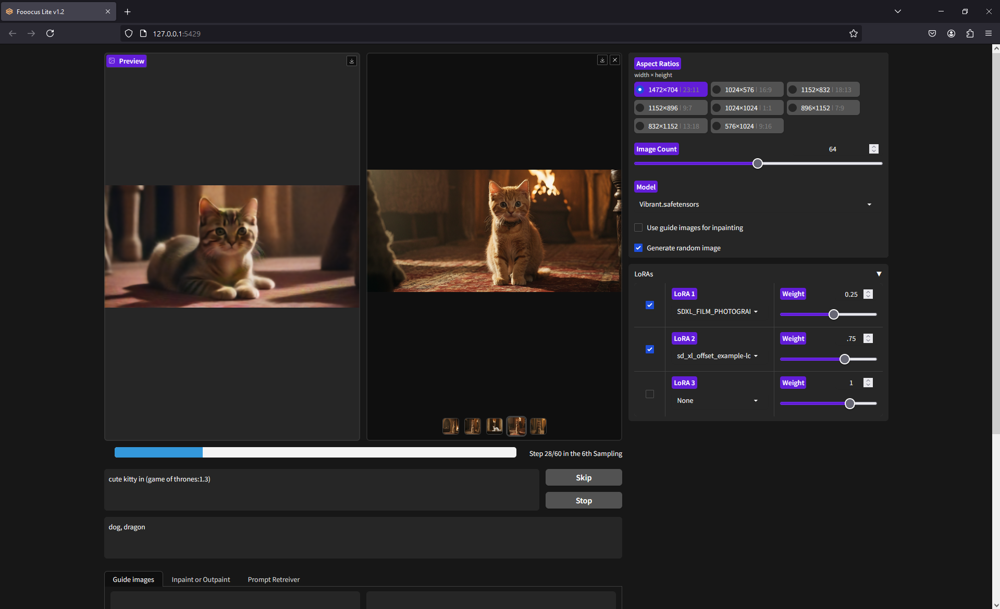

# Fooocus Lite

Fooocus Lite is a fork of [Fooocus](https://github.com/lllyasviel/Fooocus/), an image generating software (based on [Gradio](https://www.gradio.app/)), allowing the user to focus on prompting instead of tweaking numerous parameters. Find the full documentation of the original software [here](https://github.com/lllyasviel/Fooocus/blob/main/readme.md).

## Goal of this Lite version
This fork of Fooocus is made to only expose the necessary parameters of an image generation workflow in order to keep the interface as simple as possible and allow anyone to use it, even people without any experience with Stable Diffusion and image generation softwares. <br>


> Note: this tool is tailored to specifics needs and might not fit every use case.


## How to install
Please note that the following installation process might take some time and disk space (about 32Gb in total).

### One click install (Windows only)
If you are on a Windows machine, the easiest way to download Fooocus Lite is to use the installation script. See the [latest release](https://github.com/brayevalerien/Fooocus-Lite/releases/latest).

### Manual install
You can also install Fooocus Lite manually if you are not on Windows or if you have specific needs.

> Before you install Fooocus Lite, please install all the requirements:
> - [Python](https://www.python.org/downloads/)
> - [Anaconda](https://www.anaconda.com/download)
> - [Git](https://git-scm.com/)

Firstly, clone this repository in the desired directory:
```bash
git clone https://github.com/brayevalerien/Fooocus-Lite
```

Then cd into the cloned directory and create a Conda environment using Python 3.10.11:
```bash
cd Fooocus-Lite
conda create -n fooocus-lite python=3.10.11 -y
```

And activate this environment and install the required Python libraries using the `requirements.txt`:
```bash
conda activate fooocus-lite
pip install -r requirements.txt
```

You then need to install torch following the instructions on [Pytorch installation page](https://pytorch.org/get-started/locally/). The command depends on your system, but if you are using Windows and have an NVDIA GPU, the following command should work for most systems:
```bash
pip3 install torch torchvision torchaudio --index-url https://download.pytorch.org/whl/cu118
```

## How to run
Once Fooocus Lite has been installed, it can be launched by executing [`start.bat`](./start.bat) (in the root directory of Fooocus Lite).
> When Fooocus Lite is launched for the first time, it will need to set up some things and download about 27Gb of SDXL models. So make sure you have some available disk space and take a coffee!

After a few seconds, the Web UI should open in your default browser. If it is not the case, go to this URL: [http://127.0.0.1:5429](http://127.0.0.1:5429).